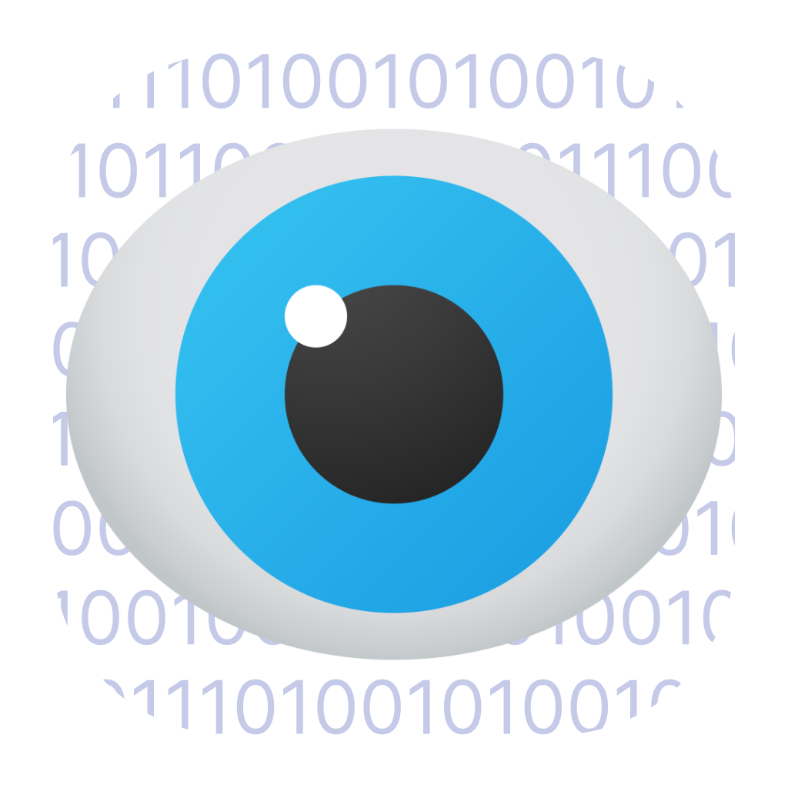

iv style="display: flex; align-items: center; margin-bottom: 16px;">
  
  <h1 style="margin-left: 16px;">TrID UI</h1>
</div>

<div style="text-align: center; margin-bottom: 16px;">

</div>

<p align="center">
  <span style="font-size: 0.95em; opacity: .8">
    <strong>English</strong> •
    <a href="README.de.md">Deutsch</a> •
    <a href="README.es.md">Español</a> •
    <a href="README.fr.md">Français</a> •
    <a href="README.it.md">Italiano</a> •
    <a href="README.ja.md">日本語</a> •
    <a href="README.pl.md">Polski</a> •
    <a href="README.pt.md">Português</a> •
    <a href="README.ru.md">Русский</a> •
    <a href="README.zh.md">简体中文</a>
  </span>
</p>

TrID UI is a lightweight desktop application that provides a user-friendly interface for TrID, a powerful tool for scanning and analyzing files. With TrID UI, users can easily select or drop files on the Home screen to initiate local scans, making it convenient to detect unrecognized filetypes.

The application uses a native Go implementation of the TrID file identification algorithm, providing fast and accurate file type detection without external dependencies.

> [!TIP]
> Download TridUI from the [Releases Page](https://github.com/JMcrafter26/TridUI/releases)

[](https://github.com/JMcrafter26/TridUI)
[](https://github.com/JMcrafter26/TridUI/releases/latest)
[](https://github.com/JMcrafter26/TridUI/issues)
[](https://github.com/JMcrafter26/TridUI/actions/workflows/release.yml)

## Features

- 🚀 Fast native Go-based file scanning
- 🎯 Accurate file type identification using TrID definitions
- 💻 Cross-platform desktop application (Windows, macOS, Linux)
- 🔒 100% local processing - no data leaves your computer
- 🎨 Modern, intuitive user interface
- 📊 Detailed match results with confidence scores
- 🔄 Drag-and-drop file support
- 🔁 Automatic definitions updates with one click
- 📅 Track last update date and definition count

## Table of Contents

<details>
<summary>Click to expand</summary>

- [Features](#features)
- [Table of Contents](#table-of-contents)
- [Demonstration and Screenshots](#demonstration-and-screenshots)
  - [Demonstration Videos](#demonstration-videos)
  - [Screenshots](#screenshots)
- [Setup](#setup)
  - [Prerequisites](#prerequisites)
    - [Option 1: Automatic Download (Recommended)](#option-1-automatic-download-recommended)
    - [Option 2: Manual Installation](#option-2-manual-installation)
  - [Building from Source](#building-from-source)
- [Usage](#usage)
- [Technical Details](#technical-details)
  - [Architecture](#architecture)
  - [TrID Scanner Implementation](#trid-scanner-implementation)
- [License and Attribution](#license-and-attribution)
- [Contributing](#contributing)
  - [Translations](#translations)

</details>

## Demonstration and Screenshots

### Demonstration Videos

<details>
<summary>Click to expand</summary>

https://github.com/user-attachments/assets/ecd4dbf3-77a3-4f07-8436-c1068e755d5f

https://github.com/user-attachments/assets/45d88137-3bf9-4c25-b516-6f344a1403a5

https://github.com/user-attachments/assets/766d55df-33e6-45d7-b2ae-cc4e02f55429

https://github.com/user-attachments/assets/c1adec87-dc68-4c0c-860f-f6f7d1cd1303

https://github.com/user-attachments/assets/6716fdbf-65c1-4c07-b8af-26a2912c84e6

https://github.com/user-attachments/assets/5c1e32e7-84ea-4815-9097-5134956f5e4d

https://github.com/user-attachments/assets/bde82ca9-fa8e-45a3-acd4-c31040aea11b

</details>

### Screenshots

<div style="overflow-x: scroll; display: flex; gap: 16px; padding-bottom: 16px; max-height: 400px; width: 100%;">
  
  
    

<details>
 <summary>Show more</summary>
  
  
    
      
      
</details>
</div>

## Setup

> [!TIP]
> You can find the pre-built binaries on the [Releases Page](https://github.com/JMcrafter26/TridUI/releases).

### Prerequisites

The application can automatically download and update the TrID definitions file for you!

#### Option 1: Automatic Download (Recommended)

1. Launch TrID UI
2. Go to Settings
3. Click "Download Definitions" or "Check for Updates"
4. The app will automatically download and install the latest definitions

#### Option 2: Manual Installation

1. Download the TrID definitions file (`triddefs.trd`) from [Mark0.net](https://mark0.net/soft-trid-deflist.html)
2. Place the `triddefs.trd` file in your application data directory:
   - **Windows**: `%APPDATA%\TridUI\triddefs.trd`
   - **macOS**: `~/Library/Application Support/TridUI/triddefs.trd`
   - **Linux**: `~/.local/share/TridUI/triddefs.trd`

You can use the "Open App Dir" button in Settings to navigate to the correct location.

### Building from Source

> **📖 Full build documentation:** See [`build/README.md`](../../build/README.md) for detailed instructions and troubleshooting.

**Quick Build:**

```bash
# Windows
.\build\build-windows.bat

# macOS
chmod +x build/build-darwin.sh && ./build/build-darwin.sh

# Linux
chmod +x build/build-linux.sh && ./build/build-linux.sh
```

**What the build scripts do:**
- ✅ Validate prerequisites (Go 1.22+, Wails CLI, Node.js, pnpm)
- ✅ Check system dependencies
- ✅ Detect optional tools (UPX, NSIS, create-dmg)
- ✅ Auto-detect architecture
- ✅ Create distributable packages

**Minimum Requirements:**
- Go 1.22+ • Node.js 20+ • pnpm 10+ • Wails CLI

**Install Wails CLI:**
```bash
go install github.com/wailsapp/wails/v2/cmd/wails@latest
```

**Output locations:**
- Windows: `build/bin/windows/TridUI-win-{arch}.exe`
- macOS: `build/bin/darwin/TridUI-macOS-{arch}.dmg` (+ .app, .zip)
- Linux: `build/bin/linux/TridUI-linux-{arch}`

## Usage

1. Launch TrID UI
2. Click or drag-and-drop a file onto the interface
3. View the scan results with confidence scores
4. The best match is highlighted at the top
5. Additional possible matches are listed below

## Technical Details

### Architecture

- **Backend**: Go (Wails framework)
- **Frontend**: SvelteKit + TypeScript + DaisyUI (& Tailwind CSS)
- **TrID Engine**: Pure Go implementation (`/trid` package)

### TrID Scanner Implementation

The TrID scanner ([`/trid/trid.go`](https://github.com/JMcrafter26/TridUI/blob/main/trid/trid.go)) is a clean-room Go implementation that:

- Parses TRD (TrID Definition) files using the binary format specification
- Performs pattern matching at specified file offsets
- Supports string matching for enhanced accuracy
- Calculates confidence scores based on pattern weights
- Returns ranked results with detailed file type information

> You can find the TRD format specification on [Mark0.net](https://mark0.net/soft-trid-format.html).

## License and Attribution

TrID UI is open-source software licensed under the GNU AGPLv3 license. The UI is developed by Cufiy (aka JMcrafter26 - me) and is based on TrID by [Marco Pontello](https://mark0.net/).
Please refer to the LICENSE file for more details.

The trid.go scanner is a clean-room Go implementation by JMcrafter26 and is licensed under the GNU AGPLv3 license.

The app icon is based on eye icon by icons8.com

<a href="https://github.com/JMcrafter26/TridUI/graphs/contributors">
  
</a>

## Contributing

Contributions are welcome! If you'd like to contribute to TrID UI, please fork the repository and submit a pull request with your changes. For major changes, please open an issue first to discuss what you would like to change.

### Translations

TrID UI needs your help to reach a wider audience! The current translations are machine-generated and may contain inaccuracies.

If you'd like to contribute translations, please follow these steps:

1. Fork the repository
2. Create a new branch for your translation
3. Add your translation files to the `translations` directory
4. Submit a pull request with your changes

Thank you for helping us make TrID UI accessible to more users!
